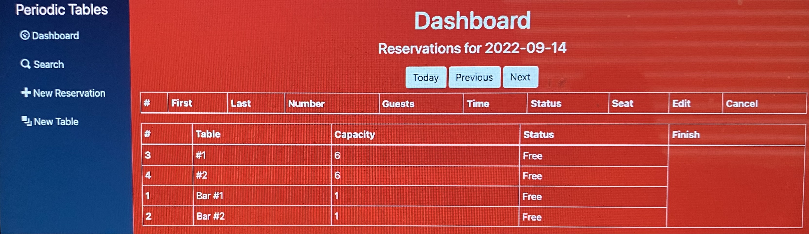

# Capstone: Restaurant Reservation System

[Restaurant Reservation Link] (https://frontend-reservation-system.herokuapp.com/dashboard)

> For this project, I have been hired as a full stack developer at _Periodic Tables_, a startup that is creating a reservation system for fine dining restaurants.
> The software is used only by restaurant personnel when a customer calls to request a reservation.

## Existing files

This repository is set up as a _monorepo_, meaning that the frontend and backend projects are in one repository.

The table below describes the folders in this starter repository:

| Folder/file path | Description                                                      |
| ---------------- | ---------------------------------------------------------------- |
| `./back-end`     | The backend project, which runs on `localhost:5001` by default.  |
| `./front-end`    | The frontend project, which runs on `localhost:3000` by default. |

**Note**: Please do not submit a pull request to this repository without permission.

## Technologies/Tools used include:

- JavaScript
- HTML
- CSS and Bootstrap
- NodeJS
- PostgreSQL
- React
- REST APIs
- Express

## Installation

1. Fork and clone this repository.
1. Run `cp ./back-end/.env.sample ./back-end/.env`.
1. Update the `./back-end/.env` file with the connection URL's to your ElephantSQL database instance.
1. Run `cp ./front-end/.env.sample ./front-end/.env`.
1. You should not need to make changes to the `./front-end/.env` file unless you want to connect to a backend at a location other than `http://localhost:5001`.
1. Run `npm install` to install project dependencies.
1. Run `npm run start:dev` to start your server in development mode.

If you have trouble getting the server to run, reach out for assistance.
